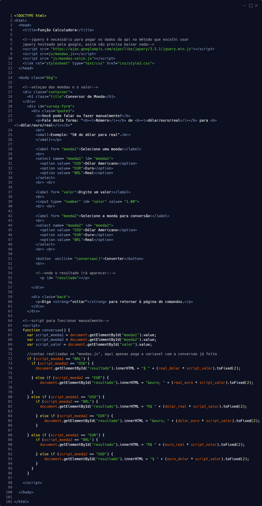
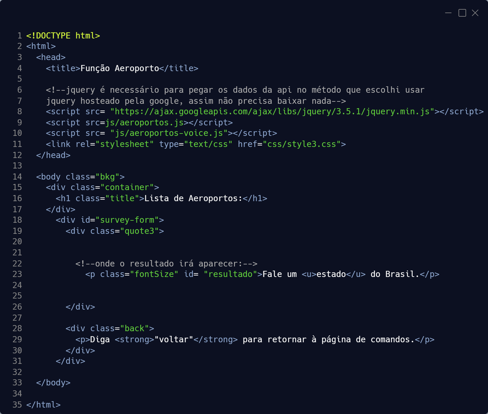
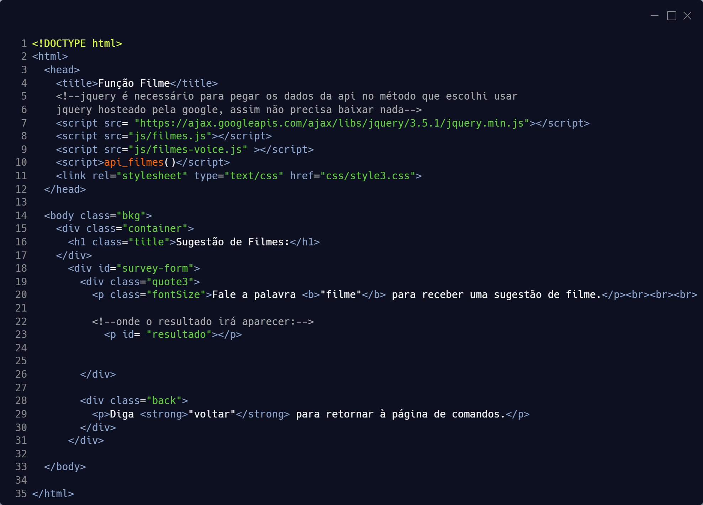

# Portfólio dos APIs (Aprendizagem por Projetos Integrados) do Curso Superior de Tecnologia em Banco de Dados - Fatec Professor Jessen Vidal (SJC)

## API 1º Semestre (2020-1)

### <center>[NUNA, assistente de voz para viagens](https://github.com/arienemaiara/assistente-voz-viagens)
<center><p></p></center>

Uma assistente ativada por comando de voz para auxiliar em viagens e na estadia.
Este projeto não foi feito em parceria com nenhuma empresa. O tema era "algum(a) assistente com alguma temática".
Meu grupo decidiu fazer uma assistente de viagens que funciona por web, assim é possivel utilizar em qualquer dispositivo
com acesso a internet. Este projeto não foi feito em parceria com empresas, mas foi desenvolvido com a ajuda de um aluno 
do sexto semestre, que foi o Scrum Master da equipe

### Tecnologias Utilizadas:
- HTML;
- CSS;
- JavaScript.

### Contribuições Pessoais:
Todas os scripts das páginas possuem a mesma base para reconhecimento de voz, que então é feito um tratamento específico 
para cada página. Esse reconhecimento de voz inicial não foi feito por mim.
<li><b>Fiz por conta própria a página de conversão de moeda com toda a lógica de pegar os dados de uma API de moedas e 
convertar os valores entre Real, Dólar e Euro.</b><br><br>

<details><summary>API de moedas:</summary>
<p></p></details><br>

<details><summary>HTML:</summary>
<p></p></details><br>

<details><summary>JS com a lógica do reconhecimento de voz:</summary>
<p></p></details><br>

<li><b>Também construi a página de aeroportos, onde o usuário diz o nome de uma cidade e é mostrado os aeroportos próximos.</b><br><br>

<details><summary>API que retorna os aeroportos próximos do local requisitado:</summary>
<p></p></details><br>

<details><summary>HTML:</summary>
<p></p></details><br>

<details><summary>JS com a lógica do reconhecimento de voz:</summary>
<p></p></details><br>

<li><b>E por fim, fiz a página de recomendação de filmes, que consome uma API desenvolvida pela Scrum Master do 6.º semestre.</b><br><br>

<details><summary>API da Scrum Master:</summary>
<p></p></details><br>

<details><summary>HTML:</summary>
<p></p></details>


### Soft Skills Desenvolvidas
 - Autonomia;
 - Trabalho em equipe;
 - Organização.

## API 2º Semestre (2020-2)

### [Software para digitação de contas de água e luz](https://github.com/DevanirRamosJr/Projeto_Integrador2)

Um software feito para que possa ser facilmente digitado os dados importantes de contas de água ou luz, que eram salvas em um banco local
e com a possibilidade de editar algum dado e gerar um csv com os dados da conta. Este projeto foi realizado em parceria com uma empresa do Parque
Tecnológico.

### Tecnologias Utilizadas:
- Java Swing;
- Banco MySQL.

### Contribuições Pessoais:
<li><b>Por volta da metade do projeto me tornei Scrum Master da equipe, então fiquei encarregado de organizar as tarefas por Sprint e informar o professor encarregado da API.</b><br><br>

<li><b>Se tratando de programação, criei uma tela de "preparação", que cria o banco com suas respectivas tabelas e permite criar usuários para a aplicação. 
Também fiz a tela inicial da aplicação, que pede os dados para conectar com o banco.</b><br><br>

<details><summary>Preparação do banco (tela base):</summary>
<p></p></details><br>

<details><summary>Preparação do banco (lógica que cria a tabela de login):</summary>
<p></p></details><br>

<details><summary>Tela inicial para conseguir conectar ao banco:</summary>
<p></p></details><br>

<li><b>Criei a tela de login do sistema.</b><br><br>

<details><summary>Tela de Login:</summary>
<p></p></details><br>

<li><b>Fiz a página de exportação para csv.</b><br><br>

<details><summary>Tela de Relatório:</summary>
<p></p></details>


### Soft Skills Desenvolvidas
 - Liderança;
 - Organização de equipe;
 - Trabalho em equipe;
 - Autonomia

## [API 3º Semestre (2021-1)](https://github.com/API-FATEC/API_3sem_2021-01)

```
                        `7MMM.     ,MMF'  .g8""8q.   `7MMM.     ,MMF'
     ,;//'     ,;//'      MMMb    dPMM  .dP'    `YM.   MMMb    dPMM      `\\.      `\\.
  ,;//'     ,;//'         M YM   ,M MM  dM'      `MM   M YM   ,M MM         `\\:.     `\\:.
,//'      ,//'            M  Mb  M' MM  MM        MM   M  Mb  M' MM            `\\.      `\\.
`\\.      `\\.            M  YM.P'  MM  MM.      ,MP   M  YM.P'  MM           ,;//'     ,;//'
   `\\:.     `\\:.        M  `YM'   MM  `Mb.    ,dP'   M  `YM'   MM        ,;//'     ,;//'
      `\\.      `\\.    .JML. `'  .JMML.  `"bmmd"'   .JML. `'  .JMML.    ,//'      ,//'
```

### MOM - Management of Operational Manuals

Foi criado um sistema para que o usuário consiga gerenciar os manuais do produto, podendo revisar, aprovar e escolher quais blocos irão formar
o manual completo. Este projeto foi realizado em parceria com uma empresa da indústria aeronáutica, em específico o time de Publicação Operacional. 
Na metade do projeto 2 membros do grupo começaram a ajudar bem menos no projeto e na última sprint só restou 2 membros ativamente trabalhando no API.

### Tecnologias Utilizadas:
- Java Spring Boot;
- Vue.js 2;
- Banco PostgreSQL.

### Contribuições Pessoais:
<li><b>Criei por conta própia uma classe referente a ler e retornar os dados de um arquivo csv.</b><br><br>

<details><summary>Classe Reader:</summary>
<p></p></details>

<br><li><b>Fiz endpoints, repository, service e teste relacionados a revisão</b><br><br>

<details><summary>Controller:</summary>
<p></p></details><br>

<details><summary>Repository:</summary>
<p></p></details><br>

<details><summary>Service:</summary>
<p></p></details><br>

<details><summary>Testes:</summary>
<p></p></details><br>

<details><summary>Script SQL usado no teste:</summary>
<p></p></details>

<br><li><b>Fiz o gerador da LEP (List of Effective Pages) de acordo com os blocos que fazem parte do manual. 
Por questão de tempo e falta de integrantes foi feito com dados pré-definidos</b><br><br>

<details><summary>LEP Generator:</summary>
<p></p></details>


### Soft Skills Desenvolvidas
 - Autonomia;
 - Trabalho em equipe.


